# MigLoop 与 CANNBot-Insight：定位、能力与取舍

> 面向第一次接触两个项目的读者。本文比较的是 2026-08-03 的本地代码实现，而不只是 README 中的功能声明。

## 先看结论

两个项目都能分析 Agent 会话，但它们解决的不是同一个核心问题。

| 项目 | 最擅长回答的问题 | 一句话定位 |
|---|---|---|
| **MigLoop** | 每个阶段、每个 Agent 实际看到了哪些源码，信息怎样进入 Spec，又怎样传到执行阶段？ | 迁移会话的**确定性证据与数据血缘分析器** |
| **CANNBot-Insight** | 多个 Agent 会话如何运行，消耗多少资源，怎样检索、比较和审计？ | 通用 Agent 会话的**可观测平台与分析仓库** |

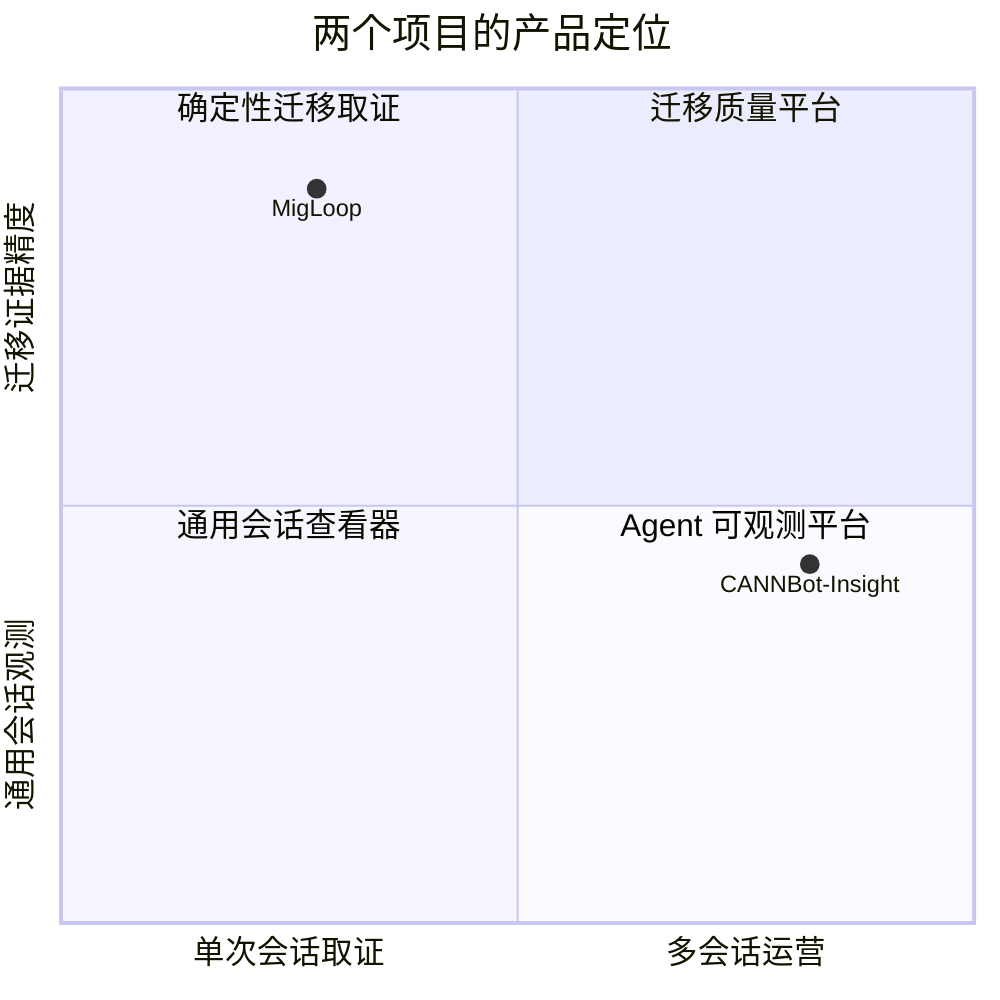

因此，当前最合理的判断不是“用哪个替换哪个”，而是：

- MigLoop 继续作为迁移会话和 Spec Eval D0 的确定性事实源；
- 借鉴 CANNBot-Insight 的多会话存储、搜索、比较、文件恢复和审计界面；
- 不建立两套互相竞争的事实提取器。

---

## 1. 两条不同的数据路线

### MigLoop：先证明发生了什么

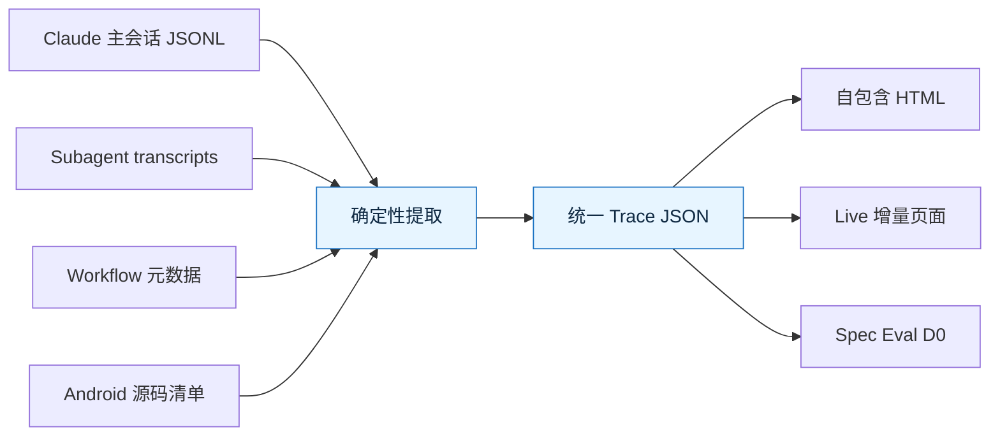

MigLoop 把原始记录视为证据，重点保存：

- 哪些源码文本真正进入了模型上下文；
- 哪个 Agent 在哪个确定性阶段读了什么、写了什么；
- 同一源码行跨 Agent 重复阅读了多少次；
- Spec 生产、计划和执行之间的信息传递是否断裂；
- 活跃、等待用户和挂起时间分别有多长。

### CANNBot-Insight：先把会话变成可查询产品

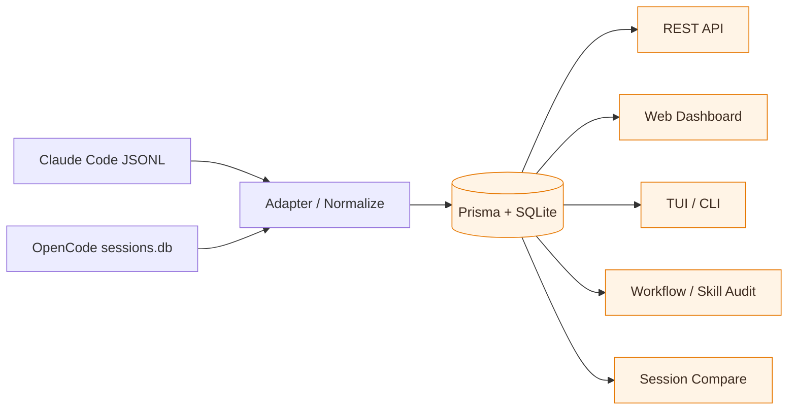

CANNBot-Insight 把会话规范化为 Session、Turn、ToolCall、SkillEvent、Execution 和 Agent bridge 等实体，重点提供：

- 多会话持久化、检索和比较；
- token、成本、上下文增长和压缩分析；
- 主 Agent、子 Agent、Skill 和工具调用关系；
- 文件读取冗余、文件内容恢复和目录重建；
- Workflow 与 Skill 的进一步审计。

---

## 2. 能力全景图

图例：**● 强项**　**◐ 有能力但有边界**　**○ 当前不是重点**

| 能力 | MigLoop | CANNBot-Insight | 说明 |
|---|:---:|:---:|---|
| 单次会话确定性取证 | ● | ◐ | MigLoop 对迁移输入输出保留更细证据 |
| 多会话数据库与查询 | ○ | ● | CANNBot 有持久化模型、API 和查询界面 |
| Claude Code 会话 | ● | ● | 两者都支持 |
| OpenCode 会话 | ○ | ● | CANNBot 有 `sessions.db` adapter |
| 真正的输入增量解析 | ● | ◐ | MigLoop 按 transcript byte offset 续读 |
| 源码可见行统计 | ● | ◐ | MigLoop 统计实际进入 tool result 的源码行 |
| Workflow 确定性阶段 | ● | ◐ | MigLoop 优先使用 Workflow/Skill 的真实边界 |
| 通用会话语义分段 | ◐ | ● | CANNBot 的 heuristic 和可选 LLM 更通用 |
| Spec / 源码 / 产物血缘 | ● | ◐ | MigLoop 是为迁移链路专门设计的 |
| 上下文与 token 观测 | ◐ | ● | CANNBot 的产品界面更丰富 |
| 文件与目录恢复 | ○ | ● | CANNBot 可依据 Read/Write 记录重建内容 |
| Skill / Agent 审计 | ◐ | ● | CANNBot 有更完整的审计产品面 |
| 自包含离线报告 | ● | ○ | MigLoop 单个 HTML 可直接分享 |
| 本地服务与交互查询 | ◐ | ● | CANNBot 是完整 Web 平台；MigLoop Live 更轻 |
| Spec Eval D0 接线 | ● | ○ | MigLoop trace 可直接提供生产者源码视野 |

---

## 3. 最关键的区别：什么叫“Agent 看过源码”

### MigLoop 的口径

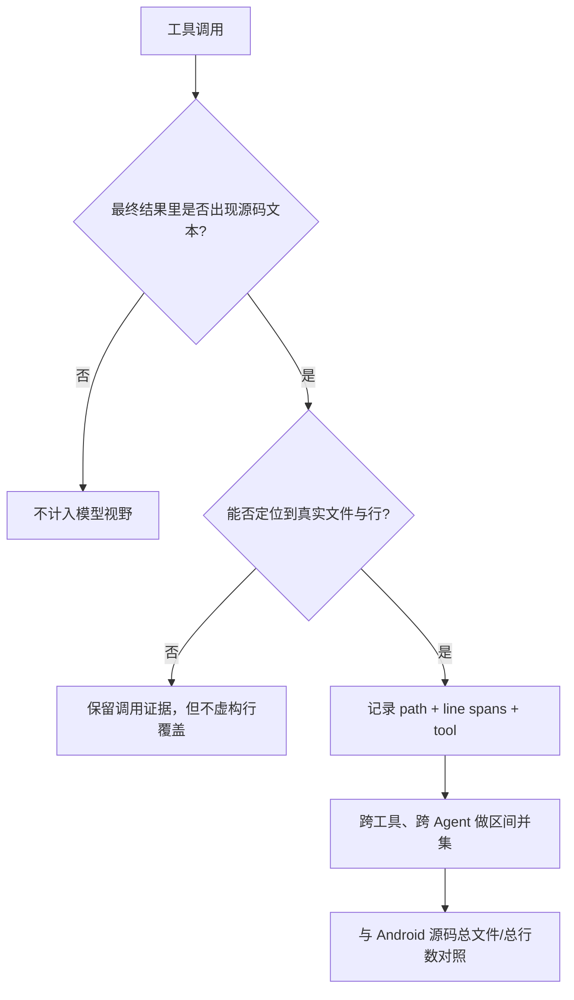

MigLoop 不把“命令碰过文件”直接等同于“模型看到了源码”：

- `Read` 按返回的真实行区间计算；
- `Grep` 只算返回的命中行和上下文行；
- Bash、PowerShell 输出要能和真实源码逐行核对；
- `find`、`ls`、`grep -l/-c/-q` 等只返回路径或计数的命令不算源码视野；
- 另行记录“探测过路径”和“源码进入上下文”，避免混淆。

### CANNBot-Insight 当前的口径

CANNBot 主要从 `Read` ToolCall 建立读取记录。它能显示文件、Agent 和读取范围，但当前代码的行数汇总只纳入 `partial` range：没有 offset/limit 的完整 Read 会被展示，却不会增加 `totalLinesRead` 和 `uniqueLinesRead`。

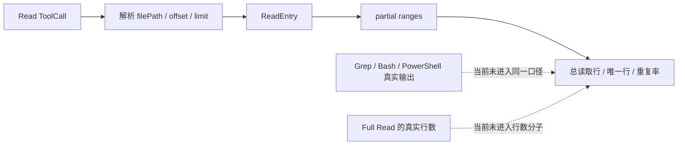

这不影响 CANNBot 做一般的会话观测，但如果要回答“模型究竟读过 Android 工程的多少源码”，当前 MigLoop 的证据口径更可靠。

---

## 4. 实时刷新：看似都是增量，含义并不一样

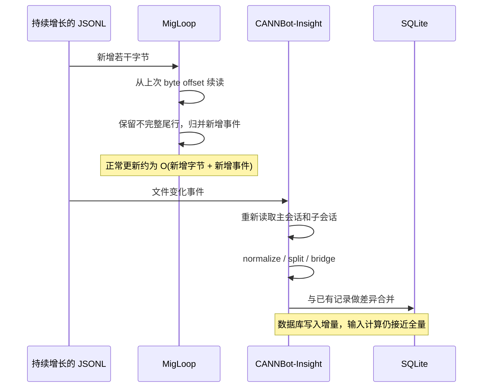

### MigLoop 的优势

- 每个 transcript 保存 byte cursor；
- 半条 JSONL 留到下一次拼接；
- 进程重启后从 checkpoint 继续；
- 文件被截断或替换时才确定性重放；
- 浏览器默认每 10 秒请求小型状态，只有显式刷新时重建完整分析页。

### CANNBot-Insight 的优势

- 数据最终稳定落入持久数据库；
- 页面、API 和多会话查询共享一套数据模型；
- 更适合长期运行的团队分析平台。

二者实际上优化的是不同成本：MigLoop 优化长会话的持续解析成本，CANNBot 优化长期产品的数据查询和管理成本。

---

## 5. 阶段与血缘：确定性和通用性的取舍

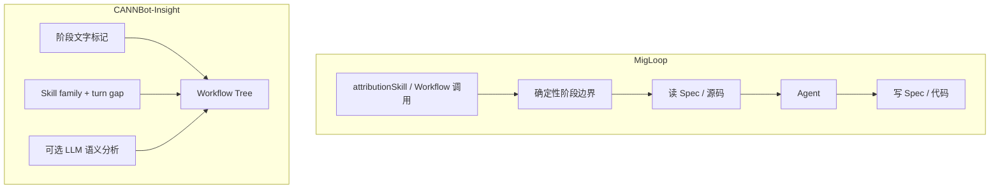

| 方案 | 优点 | 代价 |
|---|---|---|
| MigLoop | 阶段来源可以追溯到实际 Skill/Workflow 事件，适合证明迁移链路 | 没有明确 Skill/Workflow 的自由会话常退化成单一阶段 |
| CANNBot | 对各种 Agent 会话都能尝试产生结构，覆盖范围更广 | 阶段可能来自命名、时间间隔或模型判断，不总是事实边界 |

---

## 6. CANNBot 当前不如 MigLoop 的地方

这里比较的不是 CANNBot 作为通用产品是否优秀，而是它能否承担 MigLoop 当前承担的任务：为迁移过程和 Spec Eval 提供可复核的确定性证据。

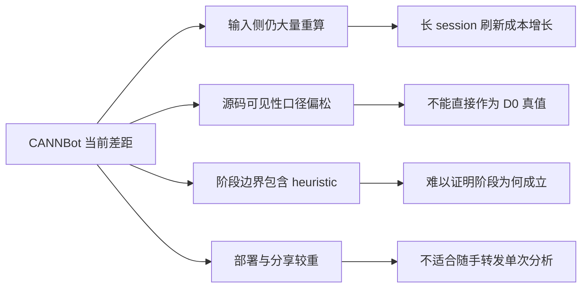

### 6.1 它不是真正的输入增量解析

CANNBot 使用文件监听触发刷新，但 [`deltaRefreshSession()`](https://gitcode.com/guanxinghua/CANNBot-Insight/blob/master/src/lib/ingest/data-service.ts#L651) 会重新读取主 JSONL 和各个子 Agent JSONL，重新完成 normalize、turn splitting 和 bridge 构建，最后才与数据库中的既有记录做差异合并。

所以它的“增量”更准确地说是：

> **数据库写入层增量，输入计算层仍接近全量。**

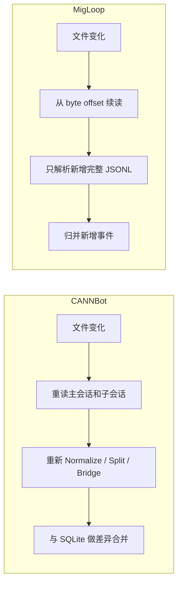

随着 session 变长，CANNBot 单次刷新要重新处理的数据也会增加。数据库不会重复插入全部记录，但这并不等于前面的解析工作没有重做。

MigLoop 的 [`IncrementalSessionMonitor`](../src/migloop/live/monitor.py#L216) 则为主会话和每个子 Agent transcript 分别保存：

- 已读 byte offset；
- 尚未写完整的 JSONL 尾部；
- 文件长度、头部签名与截断状态；
- Workflow 文件的 mtime；
- Android 源码 inventory 缓存；
- 已归并的增量统计状态。

正常刷新只处理新追加字节；只有 transcript 被截断或替换时，才丢弃旧状态并执行确定性重放。因此，在长时间持续增长的迁移会话上，MigLoop 的增量模型更稳固。

### 6.2 CANNBot 的“源码被看到”统计不够严格

CANNBot 当前主要从 `Read` ToolCall 建立文件读取记录。它没有把以下来源统一纳入“源码确实进入模型上下文”的口径：

- `Grep` 返回的源码命中行和上下文行；
- `cat/head/sed/grep` 等 Bash 命令最终输出的源码；
- PowerShell `Get-Content`、`Select-String` 的实际输出；
- “只返回文件路径或计数”与“真正返回源码文本”的区别。

另外，[`analyzeReads()`](https://gitcode.com/guanxinghua/CANNBot-Insight/blob/master/src/lib/file-reads.ts#L90) 计算行数时只汇总 `partialRanges`。没有 `offset/limit` 的完整 Read 虽然被标记和展示为 `full`，却不会增加 `totalLinesRead` 与 `uniqueLinesRead` 的行数分子。

| 场景 | CANNBot 当前口径 | MigLoop 当前口径 |
|---|---|---|
| `Read(file)` 完整读取 | 有读取记录，但不进入行数分子 | 按实际返回行计入 |
| `Grep -n pattern file` | 不进入统一源码行口径 | 只计实际返回的命中行 |
| `cat file \| grep x` | 不进入统一源码行口径 | 只计最终传给模型的匹配行 |
| `find` / `grep -l` | 不是源码行统计重点 | 只算路径探测，不算源码可见 |
| PowerShell 输出源码 | 不进入统一源码行口径 | 与真实文件逐行核对后计入 |
| 工程总量分母 | 通用文件读取分析 | Android 文件、源码行、逻辑代码和顶层节点分母 |

因此，CANNBot 的读取统计适合回答“Agent 调用了哪些 Read、哪些文件重复读了”，但还不能直接作为 D0 的“模型真实源码视野”真值。

MigLoop 的原则更严格：

1. 只有源码文本真正出现在最终 tool result 中，才算被模型看到；
2. 路径、计数和静默命令不算源码可见性；
3. “脚本探测过这个文件”和“源码进入上下文”分别记录；
4. 所有可见行跨工具、跨 Agent 做区间并集；
5. 再与 Android 工程总文件、总行数、逻辑代码和顶层节点分母对照。

### 6.3 阶段划分更偏 heuristic

CANNBot 的确定性 Workflow 切分主要依赖：

1. 主 Agent 文本中的“阶段 N”标记；
2. Skill family 与 turn gap；
3. 没有 Skill event 时使用 fallback tree；
4. 也可以调用 LLM 做语义阶段分析。

对应实现见 [`splitWorkflow()`](https://gitcode.com/guanxinghua/CANNBot-Insight/blob/master/src/lib/ingest/phase-split.ts#L164)。

LLM Workflow 分析也不会把完整 session 原样交给模型。当前 [`analyzeWorkflow()`](https://gitcode.com/guanxinghua/CANNBot-Insight/blob/master/src/lib/ai/analyzer.ts#L183) 主要组织 root turns 的摘要，单条内容和总 digest 均有长度限制；子 Agent 正文不会全部进入这一阶段分析。

这种方式的优势是通用：即使会话没有正式 Workflow 元数据，也能尝试生成一棵可读的阶段树。但它不能像 MigLoop 一样明确证明：

> 这个阶段是因为某次 Workflow/Skill 实际启动和结束而存在，而不是分析器根据文字、间隔或语义判断它“像一个阶段”。

MigLoop 优先采用 `attributionSkill`、Workflow 调用记录、编排 metadata 和状态作为阶段边界。它牺牲了一部分自由会话的语义分段能力，换来迁移流水线中的确定性与可追溯性。

### 6.4 部署和分享更重

CANNBot 是完整的本地应用，需要 Node.js、Next.js、Prisma、SQLite、依赖安装和常驻服务。这个代价换来了数据库、API、多会话管理、Web Dashboard 和 TUI，适合团队长期运营。

但如果目标只是把某一次迁移会话交给同事评审，它的交付链路会更长：

MigLoop 的离线产物是一个字体、样式与数据全部内嵌的 HTML，适合：

- 通过邮件或 IM 直接发送；
- 在评审会议中离线打开；
- 跟随 Spec Eval run 一起归档；
- 在不能安装服务或不能联网的环境中查看；
- 保存某个时刻不可变的分析快照。

反过来说，如果目标是长期积累和查询几百次会话，CANNBot 的较重架构会转化成优势。因此，这一项是使用场景的取舍，而不是绝对的工程缺陷。

---

## 7. 两边各自的优势与短板

### MigLoop

| 优势 | 为什么重要 |
|---|---|
| 源码可见行证据更严格 | 可以成为 Spec Eval D0 的可信输入 |
| 真正按新字节增量处理 | 超长、正在运行的 session 不会每次从头解析 |
| 迁移阶段血缘清晰 | 可以看到信息在哪个阶段丢失 |
| 自包含 HTML | 不启动服务、不联网也能评审和转发 |
| 零第三方 Python 依赖 | 部署和跨机器分享简单 |
| 活跃/等待/挂起分开 | 不会把等待用户的时间算作 Agent 工作效率问题 |

| 短板 | 直接影响 |
|---|---|
| 主要面向 Claude Code/Workflow | 数据源通用性不如 CANNBot |
| 没有多会话持久仓库 | 全局搜索、长期趋势和批量管理较弱 |
| 没有完整文件恢复 | 无法复原 Agent 当时读写出的目录快照 |
| 通用语义分段有限 | 非管线会话的阶段体验较弱 |
| extractor 和 HTML 模板较集中 | 功能继续增加后需要进一步模块化 |
| HTTP 聊天检索较轻量 | 适合定位证据，不是完整语义检索平台 |

### CANNBot-Insight

| 优势 | 为什么重要 |
|---|---|
| SQLite 持久化和统一实体模型 | 能承载大量历史会话 |
| Web、API、TUI 产品面完整 | 适合团队长期使用，而不只是生成报告 |
| 支持 Claude Code 与 OpenCode | 数据源更通用 |
| 上下文、成本和 Turn 观测丰富 | 更适合分析 Agent 系统效率 |
| 文件、目录重建 | 对事故分析和历史取证很有价值 |
| Workflow/Skill 审计体系 | 比单纯看调用次数更接近工程治理 |
| 测试矩阵更广 | API、adapter、CLI、UI 和集成层覆盖更完整 |

| 短板 | 直接影响 |
|---|---|
| Node + Next.js + SQLite 部署较重 | 不如单 HTML 方便分享 |
| 刷新时输入侧仍大量重算 | session 越长，持续刷新成本越高 |
| 源码视野主要依赖 Read | 无法直接作为严格的源码阅读真值 |
| Full Read 未进入当前行数分子 | 源码行覆盖统计可能明显偏低 |
| 阶段划分包含 heuristic/LLM | 可读性强，但证据确定性较弱 |
| 规范化数据库隔了一层原始记录 | 严格取证时仍需返回原始 transcript 核验 |

---

## 8. 应该选择哪一个

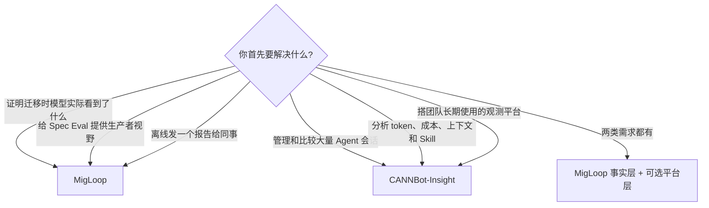

### 对当前项目的建议

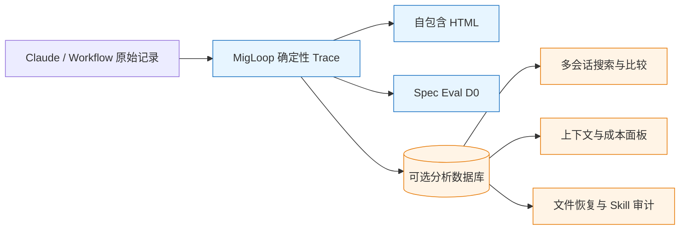

建议优先借鉴 CANNBot 的四项能力：

1. **多会话目录和 SQLite 查询层**：读取 MigLoop trace，不重新定义事实；
2. **跨会话比较与全局搜索**：把现有静态 compare 提升为可查询产品；
3. **文件/目录恢复**：作为独立证据视图，而不是修改源码视野口径；
4. **Skill/Agent 审计面板**：建立在确定性阶段和血缘之上。

应当继续保留 MigLoop 的四个基础约束：

1. byte cursor 和不完整尾行处理；
2. “路径被探测”与“源码被看到”严格分开；
3. Workflow/Skill 元数据优先于语义猜测；
4. 自包含 HTML 始终是一等产物。

---

## 9. 分析依据与边界

- CANNBot-Insight 本地版本：`9a68268`，2026-07-31；
- 对比检查了导入、增量刷新、阶段划分、LLM workflow 分析和文件读取统计的实际代码路径；
- MigLoop 当前 17 个单元测试已在本机全部通过，覆盖 live cursor、截断恢复、源码可见性、Workflow 血缘和聊天上下文；
- CANNBot 的测试目录明显更广，但本次没有安装其 npm 依赖，因此没有宣称其测试在本机全部通过；
- 这不是吞吐量 benchmark。文中的性能判断来自两边刷新算法的代码路径，而不是用同一数据集完成的计时排名。

最终可以把两者的关系概括为：

> **CANNBot-Insight 擅长把会话变成平台，MigLoop 擅长把迁移过程变成证据。**
