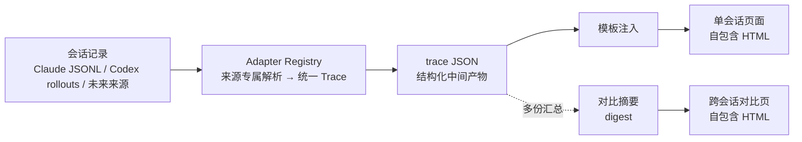
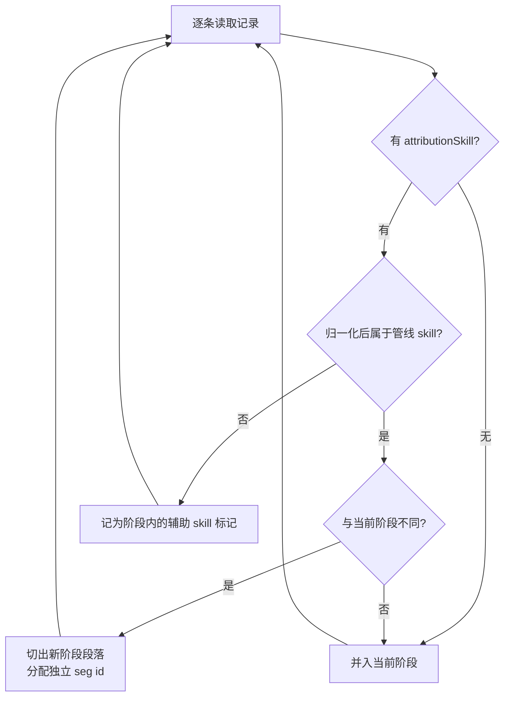
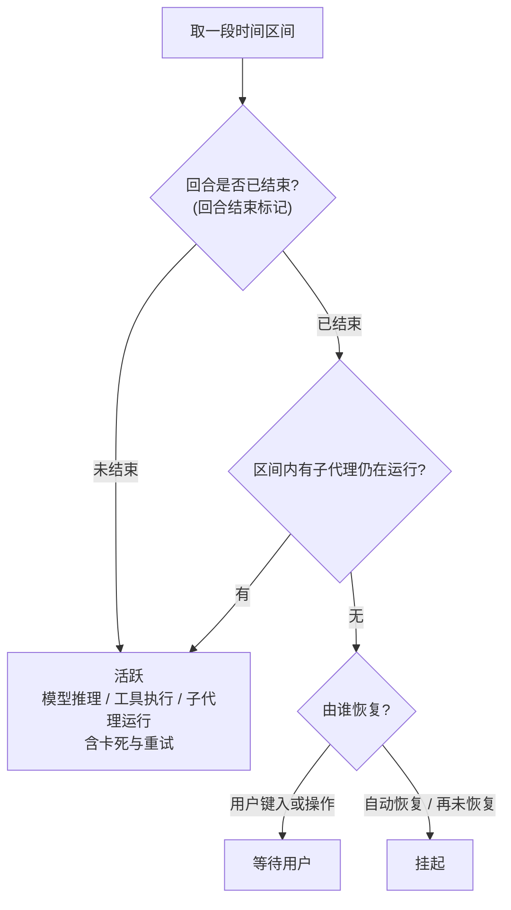
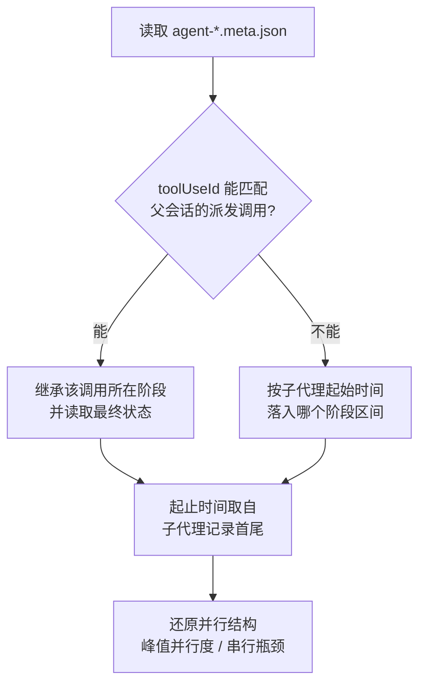

# MigLoop 设计说明

> 把 Claude Code 的会话记录,变成可以核对的数据与一页看得懂的图。

MigLoop 读取 Claude Code 落盘的会话记录(transcript),还原出一次迁移任务经历了哪些阶段、派了多少子代理、时间花在哪里、消耗了多少 token,并生成一张自包含的单文件网页。

它是**旁路只读**的:不改工作流、不装钩子、不联网。既可以在会话结束后离线生成最终页面，也可以
对仍在追加的 transcript 做 byte-offset 增量监控；两种模式都不会影响正在运行的任务。

---

## 1. 解决什么问题

一次管线跑完,往往只剩一句"做完了"。以下问题没有依据可查:

- 时间花在哪个阶段?哪一段是机器在干活,哪一段其实是在等人?
- 这次比上次快了还是慢了?贵了还是便宜了?
- 并行度如何?哪个子代理是串行瓶颈?
- 管线中途卡过吗?卡在哪一步?

答案其实**全都在 Claude Code 自己写下的记录里**,只是读不动——一次会话动辄几千行、几十 MB。MigLoop 的职责就是:把这堆记录读成结构化数据,再画成一页能看懂的图。

---

## 2. 总体流水线

整条链路只有三步。中间的 **trace JSON 是唯一的真相来源**,页面只是它的一种渲染方式——因此同一份数据既能出单会话页,也能汇总成多会话对比页。



抽取与渲染分离带来两个好处:渲染改版不必重新解析原始记录;新增视图(对比页、后续的评测页)只需消费同一份 trace JSON。

---

## 3. 数据来源

Claude Code 把每次会话写成一个 JSONL 文件(一行一条记录),并为每个子代理单独保存一份完整对话。

```text
<session-id>.jsonl              主会话:用户输入、模型回复、工具调用、用量、压缩标记
<session-id>/
└─ subagents/
   ├─ agent-<id>.jsonl          子代理的完整对话与用量
   └─ agent-<id>.meta.json      agentType / description / toolUseId / spawnDepth
```

> **子代理目录是关键。** 缺了它就只能看到"派了个任务",无法还原并行结构与真实耗时。分享会话时必须一并打包。

解析所依赖的关键字段:

| 字段 | 位置 | 用途 |
| --- | --- | --- |
| `attributionSkill` | 每条记录 | 该记录归属哪个 skill,**阶段切分的主信号** |
| `message.usage` | 模型回复 | 输入 / 缓存读 / 缓存写 / 输出 token,计费与上下文占用的唯一权威来源 |
| `message.id` | 模型回复 | 同一条回复的多条流式记录共享此 id,用于去重 |
| `toolUseId` | 子代理 meta | 指回父会话的派发调用,用于确定子代理归属哪个阶段 |
| `turn_duration` / `stop_hook_summary` | 系统记录 | 回合结束标记,**时长记账的基石** |
| `compact_boundary` | 系统记录 | 上下文压缩发生点 |
| `promptSource: typed` | 用户记录 | 区分人真正键入的内容与系统注入的内容 |

---

## 4. 核心算法之一:阶段切分

按记录自带的 `attributionSkill` 顺序扫描,**归属发生管线级切换的位置即为阶段边界**。



**为什么不用"检测 Skill 工具调用"作为主信号:** 阶段可以在没有再次触发调用的情况下生效——续跑、斜杠命令进入、在记录导出边界之前进入,都会漏判,严重时整场会话只切出一个阶段。工具调用只作为兜底信号保留。

设计要点:

- **归一化 skill 名。** 打包成插件后 skill 名会带前缀(如 `plugin:skill-name`),比对前需剥离命名空间,否则识别全部失效。
- **同名阶段必须分段。** 验证不通过退回执行会产生第二段同名阶段;每段分配独立 `seg id`,否则两段会被合并,回退过程从图上消失。
- **非管线 skill 不切段。** 结构检查、文档查询等辅助 skill 记为当前阶段内的标记,不制造虚假边界。
- **无管线会话回退。** 不含管线 skill 的普通会话整场作为单一阶段呈现,时长与用量照常可看。

---

## 5. 核心算法之二:用量结算

同一条模型回复在流式写入下会产生多条记录,共享同一个 `message.id`。输入侧字段各条一致,但**输出 token 是逐步累计的**——只有最后一条是最终值。

| 写入顺序 | message.id | 输入 | 缓存读 | 输出 tokens | 取值 |
| --- | --- | --- | --- | --- | --- |
| 第 1 条 | `msg_01A…` | 1,204 | 96,180 | 7 | ✗ 取此则严重低估 |
| 第 2 条 | `msg_01A…` | 1,204 | 96,180 | 84 | |
| 第 3 条 | `msg_01A…` | 1,204 | 96,180 | 512 | |
| **第 4 条(末)** | `msg_01A…` | 1,204 | 96,180 | **1,362** | ✓ 权威值 |

因此去重规则是:**按 `message.id` 分组,取最后一条记录**。取首条会让输出量偏低整整一个数量级,成本随之算错。

结算按模型分桶,主会话与子代理合并计入:

```text
billing[model] = {
  req    请求数
  inp    未缓存输入 token
  cread  缓存读 token
  cw5    缓存写 token(5 分钟档)
  cw1h   缓存写 token(1 小时档)
  out    输出 token
}
```

缓存写的两档留存时间单价不同,必须分开统计,合并会算错成本。

另外两条规则:

- **过滤合成记录。** 连接错误等由客户端本地合成的记录用量全零,按模型标记剔除,否则请求数虚高。
- **上下文占用 = 输入 + 缓存读 + 缓存写。** 逐次采样即得上下文曲线,与压缩标记叠加即可看出窗口压力与压缩节奏。

> 交互式的用量面板不落盘,事后无从查证。`message.usage` 是唯一能复核的口径,任何数字都应能回溯到它。

---

## 6. 核心算法之三:时长三段账

会话跨了几十小时,不代表干了几十小时的活。墙钟被拆成三段,只有**活跃**才是真实工作量。



三段的定义与含义:

| 分类 | 判定 | 含义 |
| --- | --- | --- |
| **活跃** | 回合进行中,或有子代理在运行 | 真实工作量。**回合内的长时间静默(模型重试、子代理卡死)也算活跃**,因为会话并没有停 |
| **等待用户** | 回合已结束,由人的输入或操作恢复 | 流程在等人。这是流程设计问题,不是机器慢 |
| **挂起** | 回合已结束,非用户方式恢复或再未恢复 | 合盖、搁置、会话终止等 |

判据是"**会话停没停**",而不是"有没有东西在动"。这条界线看似细微,却直接决定指标是否可信:

- 若用"墙钟 − 等待用户"倒推活跃,凡是不以用户动作结尾的搁置时段都会被算进活跃,几十小时的空白会凭空变成工作量。
- 若把"没有任何记录写入"一律判为非活跃,管线内部的卡死重试就会被扣掉,而那段时间会话确实在运行。
- 主会话静默但子代理在跑,属于活跃——异步派发时主线本就没有记录可写。

**可核对性是这一算法的验收标准:** 每个阶段的活跃时长应当能与该阶段的甘特图逐段对上。若图上大片空白却仍计为活跃,说明判据出了问题。

---

## 7. 核心算法之四:子代理回链



较早版本的客户端在异步派发时不落盘派发调用,主会话只留下完成通知,回链会断裂。此时改用时间区间兜底,可把失联子代理降到零。

**耗时可交叉验证。** 子代理记录首尾的时间跨度,应与父会话收到完成通知的时间基本一致——两者来自两份独立文件,互证即可确认统计无误。

一个常见的解读陷阱:某个子代理连续跑数小时,并不等于"卡住了"。判断依据是它内部的记录密度——若记录间隔始终是秒级、模型请求均匀分布,那就是任务本身重(典型如"编译 → 读错误 → 定位 → 改代码"的循环,其中编译只占极小部分,绝大多数时间是模型在推理)。真正的卡死表现为长时间无任何记录写入。

---

## 8. 产出:页面读什么

页面按"先结论、后细节"排布:顶部是概览瓦片与模型用量表,往下依次是结构、过程、对比、细节。

| 分区 | 内容 |
| --- | --- |
| 执行拓扑 | 阶段主链 + 每阶段派出的子代理种类与数量 |
| 执行链路 | 类 git 图:主干是主会话,分支是并行子代理,含派发与合并时刻 |
| 阶段对比 | 各阶段活跃时长、工具数、子代理数、输出量横向比较 |
| 上下文 | 上下文占用曲线与压缩点 |
| Skill 统计 | 主会话与子代理的 skill 调用合并统计,含失败次数与逐次记录 |
| 阶段明细 | 甘特泳道:每个子代理的起止、模型、输出量,点击展开详情 |

页面是**完全自包含**的:数据与字体全部内嵌,无任何外部资源与网络请求。双击即看,断网可用,交互与明暗主题切换全在本地完成。

---

## 9. 数据模型

trace JSON 的结构(字段名与实际产出一致):

```jsonc
{
  "meta":    { "schema_version", "session_id", "cc_version", "cwd", "model",
               "started_at", "ended_at", "record_count", "source_file" },

  "totals":  { "duration_ms", "active_ms", "user_wait_ms",
               "tool_calls", "agent_calls", "subagent_transcripts",
               "main_output_tokens", "subagent_output_tokens",
               "user_prompts", "files_touched", "compactions" },

  "stages":  [ { "id", "stage", "label", "start_ts", "end_ts",
                 "duration_ms", "active_ms", "wait_ms",
                 "tool_counts", "output_tokens", "cache_read_tokens",
                 "agent_count", "helper_skills", "artifacts", "prompt_idxs" } ],

  "tools":   [ { "seq", "ts", "name", "brief", "dur_ms", "ok",
                 "result", "stage", "seg", "tuid" } ],

  "agents":  [ { "agent_id", "type", "desc", "model", "status",
                 "start_ts", "end_ts", "dur_ms", "output_tokens",
                 "tool_uses", "tool_counts", "skills", "skill_calls",
                 "stage", "seg", "tuid" } ],

  "prompts": [ { "ts", "text", "wait_ms", "stage", "seg" } ],
  "markers": [ { "ts", "kind" } ],

  "context_timeline": [ { "ts", "ctx", "inp", "cread", "cwrite", "out" } ],

  "billing": { "<model>": { "req", "inp", "cread", "cw5", "cw1h", "out" } }
}
```

`stage` 是阶段类型,`seg` 是段落实例 id——同一类型出现多次时靠 `seg` 区分。

---

## 10. 兼容性设计

记录格式随客户端版本演进,管线本身也在变。抽取器对以下变化保持容错:

| 变化 | 表现 | 处理方式 |
| --- | --- | --- |
| skill 打包为插件 | skill 名带命名空间前缀 | 比对前归一化,否则阶段识别整体失效 |
| 管线新增阶段或语言变体 | 出现未知的管线 skill 名 | 阶段表可扩展,新增即纳入并配色 |
| 异步派发不落盘 | 子代理回链断裂 | 按时间区间兜底归属 |
| 压缩阈值调整 | 压缩由频繁变罕见 | 只读实际压缩标记,不假设阈值 |
| 跨机器导入 | 路径分隔符与目录布局不同 | 只认文件内容,任意路径均可 |
| 无管线的普通会话 | 无阶段信号 | 回退为单一阶段,时长与用量照常 |

**设计原则:只读事实,不假设约定。** 凡是能从记录里直接读到的(压缩点、回合边界、skill 归属)就读,不靠版本号推断行为;凡是可能缺失的(派发调用)都准备兜底路径。

---

## 11. 工程约束与已知坑

| 坑 | 后果 | 对策 |
| --- | --- | --- |
| 按 `message.id` 去重取首条 | 输出 token 严重低估,成本连带算错 | 必须取末条 |
| 同名阶段未分段 | 回退过程消失 | 每段分配独立 `seg id` |
| 合成记录未过滤 | 请求数虚高 | 按模型标记剔除 |
| 页面标题不唯一 | 多个页面在浏览器标签中无法分辨,易看错会话 | 标题注入项目名与会话短 id |
| 深层目录 + 长路径 | 解压失败(Windows) | 解压到短路径再处理 |
| 源记录含无法解码的字符 | 部分发布通道拒收 | 注入前统一清洗 |
| 输出含中文而终端编码非 UTF-8 | 脚本崩溃(Windows) | 显式设定输出编码 |

---

## 12. 用法与分发

工具打包为单文件 `migloop.pyz`(Python zipapp),Python ≥ 3.9 即可运行,无需安装任何依赖,Windows 与 macOS 通用。

```bash
# 指定任意路径的会话文件,生成单会话页面
py migloop.pyz <会话.jsonl>

# 按会话 id 前缀或工程名片段查找本机会话,生成后直接打开
py migloop.pyz <关键词> --open

# 多个会话生成一页跨会话对比
py migloop.pyz A B C --compare
```

> macOS 上把 `py` 换成 `python3`。

分发分两种:

- **给别人看结论** → 发生成的 HTML。自包含,双击即看,无需任何环境。
- **让别人分析自己的会话** → 发工具包。对方需要 Python 环境。

收别人的会话记录时,提醒对方连**子代理目录**一起打包。

> **注意内容敏感性。** 页面内含完整轨迹:工程路径、用户输入原文、命令摘要、成本数字。团队内分享无碍,对外发送前应先确认内容是否合适。

---

## 13. 后续方向

- **评测页。** 目前呈现的是"发生了什么";下一步是按显式契约(阶段应产出哪些文件、回退轮数上限等)自动判分,回答"做得好不好"。
- **批量导入。** 一次纳入历史全部会话,让趋势线跨越更长时间。
- **增量实时页（已实现）。** 主会话/子 agent JSONL 按 byte cursor 续读，Workflow 元数据按 mtime 更新；
  浏览器只接收聚合状态，停止时再由离线 extractor 做最终一致性校验。无需运行时钩子。
