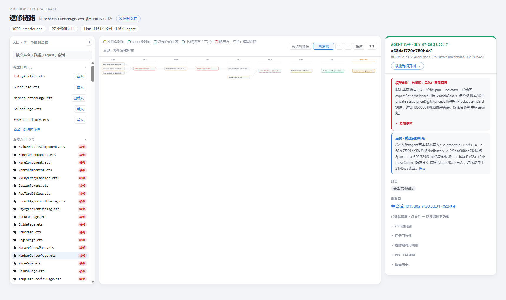
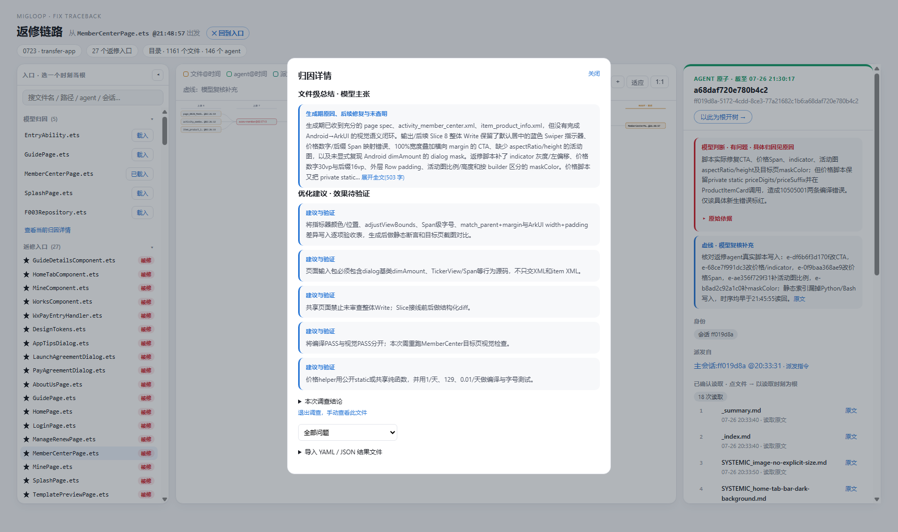

# Migloop：面向迁移数据飞轮的返修归因与情景卡片

2026-09-15 · 项目汇报

## 1. 任务：让一次迁移的返修，成为下一次生成的经验

Android → HarmonyOS 迁移并不止于生成代码。生成完成后，visual verify、DT verify、ECAT 等验证与修复环节还会继续修改工程。这些真实修改，提供了反查生成流程的入口：**改了什么、为什么要改、生成时为什么没有一次做对？**

我们的目标，是利用真实用户的迁移数据，把这些问题整理成有证据的经验，进一步用于提出 issue、优化 skill 和编排、沉淀案例知识库，而不是每次迁移结束后只留下代码和一份修复报告。

```text
迁移生成 → 验证与返修 → 反查历史输入和输出 → 保存情景卡
                                               ↓
下一次迁移 ← 验证优化效果 ← 修改 skill / 编排 / 验收规则
```

Migloop 当前重点实现的是中间这一段：把返修记录转成**可解释、可追溯、可重新打开核查的归因材料**。改进是否真正减少下一轮返修，则由后续迁移验证闭环。

## 2. Motivation：为什么不能只让模型读完转录写总结

### 2.1 关键词相关，不等于存在因果关系

模型自由 grep 可以找到大量材料，但一个 spec 写了某个要求，不代表负责生成的 agent 实际读过；后期文件里出现错误代码，也不能直接证明最初生成者就写错了。关键词相似、文件同名、时间相近，都不足以确认历史读写关系。

因此，归因需要回答的不只是“找到什么”，还包括：**谁在什么时候实际收到什么、写出了什么，以及这些输出是否传到了被修文件。**

### 2.2 散文报告难以低成本复查

报告即使写得合理，审阅者仍需要重新定位转录、区分 agent、对齐时间，再核对输入输出。让另一个模型继续审阅可以辅助检查，但不能替代原始依据，也可能重复同一误判。

我们希望把证据入口放在结论旁边：看到有问题的节点，就能打开原因、相邻关系和原始调用，不必重做整次调查。

### 2.3 找到直接写者，不等于解释了生成失败

弱模型容易停在“这个 agent 写出了坏代码”，或者照抄修复方的解释。真正能支持流程优化的调查，还要核实该 agent 的历史输入，包括源码、spec、skill 和派发任务。

停止上溯的标准不是固定跳数，而是：对当前问题，已找到正确、清晰且实际交付的相关输入，并观察到输出偏离；如果输入本身有缺口，就继续追输入的形成过程。遇到缺失转录或不可追溯的外部输入，则明确保留边界，不强行归罪某个 skill。

## 3. 方案：两原子既用于调查，也用于结论查验和展示

Migloop 以两个自然对象组织迁移历史：

- **文件 + 时间**：查看该时间之前的已确认读写、相关调用、修改片段，以及某次 Write 或 Read 实际记录的内容。
- **Agent + 时间**：查看该时间之前的任务、输入、工具调用和输出，继续追溯派发者及上游文件。

时间是统一范围，关键写入与读取时刻是导航入口。中间存在不透明操作时，不把早期快照冒充为后续时刻的完整文件。

已识别读写提供结构化入口；无法可靠解析的脚本或调用仍保留原始记录供核查。搜索命中可以支持进一步调查，但不会仅因命中关键词就自动变成读写边。

模型可以借助 MCP 按需查询，也可以直接调查原始材料。**调查方式允许自由选择，最终交付则需要明确结论所依赖的证据链。** 调查访问记录与历史读写关系分开：前者说明模型查过什么，后者才是图中连接的依据。

### 机械校验负责什么

模型提交节点、时间和连接后，系统核对对象是否存在、原始引用能否定位、时间范围是否匹配、声明的读写或派发关系是否有历史依据。发现问题时，把具体诊断交回模型复核。

反馈的目的不只是把表填对。模型应判断：受质疑的连接支持了哪一句归因；重新核对实际输入、输出和传播后，这句归因应保留、修正、降低确定性，还是撤回；随后同步修改节点原因、连接、总结和建议。

静态分析无法确认的脚本读写，可以在反馈后由模型补充原始调用依据与解释，作为**虚线关系**保留。虚线表示模型复核补充，不伪装成静态已确认事实。

这一层能检查证据结构，不能自动证明所有自然语言因果断言。图中标红表示模型判断；引用可定位、关系成立与原因正确，是不同层次的检查。

## 4. 产品形态：同一张返修页面，支持手动调查和模型结果审阅

用户从 server 主页面选择一次迁移，再进入“返修链路”：

1. **手动调查**：左侧保留被修文件列表，选择文件和时刻；从文件找写者，从 agent 找输入和派发来源，逐层向前展开。
2. **载入模型归因**：左侧“模型归因”列出该迁移已保存的文件情景卡，点击“载入”，在同一棵树上展示结论。
3. **逐节点核查**：红色节点带原因，右侧可展开原始依据、读写记录、原文和 diff；脚本复核关系以虚线呈现。
4. **继续探索**：载入后默认冻结，点击节点只看详情，不意外改变树。需要自行补查时，解冻后沿同一套关系继续展开。

文件级总结和 recommendation 通过“总结与建议”入口查看。人和模型共享查询内核与原始证据，页面是这些数据的可视化投影，不另外维护一套归因逻辑。



图：当前 server 本地集成的会员页情景卡。右侧选中的是返修阶段引入 helper 访问级别错误的节点，显示原因和脚本依据。截图用于展示当前产品形态，不是后文 i14 计分原稿。

## 5. 情景卡：把总结、建议和证据树一起保存

一张情景卡以“迁移、被修文件、调查区间”为单位，回答四个问题：

- **修了什么**：实际修改及其目的，区分生成缺陷、后置新要求和返修引入的新错。
- **为什么没有一次做对**：相关输入、输出偏离位置，以及后续保留或传播环节。
- **以后怎么优化**：面向 skill、交付输入、编排或验收的建议，并说明如何验证。
- **凭什么这样判断**：节点原因、时间坐标、历史关系、原始引用及未确定之处。

### 模型填写的结构

下面摘编会员页“价格返修又引入编译错误”的分支，重新编号以说明字段；**这是汇报用结构示例，不是完整可加载原稿**。完整原稿附在本报告旁，未经改写。

```yaml
target:
  key: entry/src/main/ets/pages/MemberCenterPage.ets
  since: "2026-07-24T22:16:20.102Z"
  at: "2026-07-26T21:48:57.793Z"

summary: >-
  价格显示返修引入了跨结构调用 private helper 的编译错误；
  后续两次 Edit 修正访问级别。此问题属于返修，不倒归生成期。
recommendations:
  - 跨结构 helper 修改后执行编译验收；视觉效果另做截图验证。

nodes:
  - key: "ff019d8a-5172-4cdd-8ce3-77a21682c1b6:a68daf720e780b4c2"
    at: "2026-07-26T21:42:48.249Z"
    problem: true
    reason: 价格脚本引入 private static helper，却在另一结构体中调用。
  - key: entry/src/main/ets/pages/MemberCenterPage.ets
    at: "2026-07-26T21:45:55.438Z"
    reason: 编译验证 agent 实际读到了 helper 与跨结构调用代码。
  - key: "ff019d8a-5172-4cdd-8ce3-77a21682c1b6:af0e3d2ae54dbf769"
    at: "2026-07-26T21:46:12.801Z"
    reason: 根据编译错误，分别去掉两个 helper 的 private。

edges:
  - from: 1
    to: 2
    force: true
    reason: 复核价格修复脚本，确认其写入目标文件；静态索引未识别该写入。
    evidence: ["e-68ce7f991dc3", "e-0f9baa368ae9"]
  - from: 2
    to: 3
  - from: 3
    to: target
```

普通节点填写路径或 agent 身份、时间和原因；有问题的节点标 `problem: true`。连接通过节点序号声明，系统解析实际对象并绑定已确认关系的原始依据。只有需要人工式复核补充的关系，才额外填写 `force`、理由和证据；不是让模型随意补一条线。示例中的 `force` 对应收到反馈后的复核稿，首次提交不允许使用。

同一个文件或 agent 可以以不同时间多次出现在树上，分别表示不同历史状态。情景卡因而可以呈现“输入正常 → 输出偏离 → 后续读取和传播 → 修复”，而不是把所有写者一次平铺在目标旁边。

完整示例：[会员页模型原稿](assets/2026-09-15-migloop/MemberCenterPage.ets.yaml)。文件采用 JSON 语法，是合法 YAML；它与当前展示卡保存的原稿逐字一致。卡片应在对应迁移的数据快照中校验、载入，而不是脱离原始数据单独认证。



## 6. 案例：区分“最早写过这段代码”与“问题实际在哪一步形成”

### 会员页价格后缀字号

返修将价格数字和“/天”后缀拆成不同字号。如果只看到早期文件里的一个 30 号 Text，很容易把缺陷直接归到最初写者。

i14 的调查进一步核实：初始 converter 的 `priceText` 契约是数字，真实业务数据尚未接入；后续 Slice8 实际读到了 Android Kotlin 的分段字号实现，却在接入 `showNowPrice` 时只删除货币符号，保留后缀，继续整串使用 30 号字号。

```text
Android 分段字号实现
  └─ Slice8 实际读取
       └─ 接入含后缀价格，却输出整串 30 号 Text ← 最早已证的相关偏离
            └─ MemberCenterPage 对应输出
                 └─ 返修拆成数字／后缀两个 Span
```

这比“某 agent 没实现好”更有行动价值：可将价格数字、后缀、日均价的数据契约写清，并把富文本分段语义作为业务接入时的验收项，使用有后缀、无后缀、小数价格分别验证。该结论来自 [i14 会员页原稿的 finding D](C:/Users/hongy/projects/_migloop-eval-20260909/file-first-10/inquiry-iterations-20260911/i14-high/F10-01/runs/inquiry/rep1/verdict.yaml)。

### 证据链核验的实际作用

已有实验还记录了两种具体修订：

| 原稿问题 | 核验与复查后的变化 | 体现的价值 |
| --- | --- | --- |
| 将查询结果 ID 当成原始证据 ID | 引用被拒绝后，模型改为可以定位到转录的原始引用 | 结论中的依据可真正打开，不只是看起来像引用 |
| 将 21:30 才形成的固定 Span/helper 实现挂在 21:24 的文件节点 | 核对实际修改和读取后，改为编译 agent 在 21:45 实际读到的状态 | 避免把未来状态挂进过去的证据链 |

第一例来自 i14，第二例来自后续情景卡交付试验。这些是已记录的引用与时序纠正，不把修好引用等同于自动修正所有归因。证据见 [i14 观察记录](../experiments/inquiry-20260911/i14-observations.md) 与 [情景卡首末稿审阅](../experiments/inquiry-20260911/case-card-single-run-adjudication.md)。

## 7. 实验结果：Luna 完成 27/28 项核心归因解释

在 0723、DiceRoller、Codex AIPPT 三次真实迁移的 **10 个被修文件**上，历史冻结版本 i14 使用 **gpt-5.6-luna / high** 完成调查，按预先登记的 28 项核心解释单元核验：

| 迁移数据 | 被修文件数 | 核心解释完成 |
| --- | ---: | ---: |
| 0723（Claude 会话） | 5 | 16/17 |
| DiceRoller（Claude 会话） | 3 | 9/9 |
| AIPPT（Codex rollout） | 2 | 2/2 |
| 合计 | 10 | **27/28，96.4%** |

这里的“完成”要求核心原因和责任边界有原始证据支持，不要求报告措辞与参考答案一致，也不是只按 YAML 格式或引用是否存在打分。

口径：这是历史开发集上 i14 一次完整十文件运行的**核心解释覆盖**，由开发者结合原稿和原始证据审阅；不是全文断言准确率、盲评或泛化保证。当前情景卡、机械反馈协议和 server UI 是后续交付能力，不冒充 i14 原样重测的结果。本报告不作原始组或成本优越性的对比宣称。[固定评分](../experiments/inquiry-20260911/i14-high-scores.json) · [核心判定标准](../experiments/file-first-10/scoring-core.json)

## 8. 当前交付与演示

目前已完成：Claude/Codex 历史材料接入，两原子时间查询与手动探索，结构化情景卡保存和校验，节点原因与原始依据展示，以及在 server 原迁移入口中的本地集成。

本地演示数据包括 0723 和 Codex 两组会话；0723 保留 27 个返修文件入口和 5 张已保存的文件情景卡。这些卡来自已有调查产物的导入，并非打开页面就自动生成。

演示路线约 3 分钟：

1. 打开 [server 主页面](http://127.0.0.1:8879/)，选择 0723，进入右上角“返修链路”。
2. 在返修入口中选择会员页，手动展开写者、输入，查看某次原文或 diff。
3. 点击“模型归因”下会员页的“载入”，查看已保存的树。
4. 点击问题节点，阅读原因和原始依据；用“总结与建议”查看文件级结论。
5. 解冻后继续人工调查，或切换另一张卡。

直达演示：[会员页情景卡](http://127.0.0.1:8879/api/v1/agent-perf/sessions/0723/fixchain?report=0ce3bb6f2caa4132) · [Codex 情景卡](http://127.0.0.1:8879/api/v1/agent-perf/sessions/codex/fixchain?report=23a887f51a9e448b)

以上是本机地址，需本地服务运行，不是其他人可直接访问的公网链接。当前已实现保存结果的载入与手工探索；server 端“一键启动 AI 归因”尚待接入，生产部署也未在本次完成。

## 9. 下一步：从可复查案例走向可验证的优化

先把情景卡做成可靠的经验入口，再将多张卡中有共同依据的问题归并为候选改进项：适用条件、错误模式、证据案例、建议修改的 skill/环节，以及验收方法。

例如，价格分段语义丢失可以形成一条跨框架富文本迁移规则；返修引入 helper 编译错误可以形成“视觉修改后必须编译”的交付门禁。先在同一 app 上验证是否减少同类返修，再验证相似 app 和不同 app 是否受益。未经验证的建议保留为候选经验，不直接升级为通用规则。

**最终交付不只是一个总结，而是一张有原因、有建议、有原始依据、能重新打开核查的情景卡。** 这使迁移返修从一次性成本，转变为可复用、可验证的流程改进材料。

---

### 汇报口播摘要

我们希望把真实迁移中的返修变成数据飞轮：对比生成结果与后续修复，反查历史输入和输出，定位在哪一步偏离，并据此优化 skill、编排和验收。Migloop 用文件与 agent 两类时间节点组织证据，人可以手动调查，模型也可以形成情景卡，载入同一页面逐节点复查；历史 Luna 实验在三次迁移、十个被修文件上完成了 27/28 项核心归因解释。目前已完成情景卡和 server 本地展示集成，下一步用这些可复查案例验证实际迁移改进收益。

### 备查

- 评测文件：MemberCenterPage、SplashPage、GuidePage、0723 EntryAbility、F003Repository；DiceRoller Index、EntryAbility、AppScope/app.json5；Codex LaunchAgreementDialog、build-profile.json5。
- [固定十文件评测契约](../experiments/file-first-10/evaluation-contract.md)与 [i14 评分原始记录](../experiments/inquiry-20260911/i14-high-scores.json)。
- [会员页情景卡原稿](assets/2026-09-15-migloop/MemberCenterPage.ets.yaml)，report ID：`0ce3bb6f2caa4132`；SHA256：`66ac3799c016fb2d995ea5b87f7e7201d8de899adc221535b059838ea051bb47`。
- server 本地集成：`C:/Users/hongy/projects/migbot-server-inquiry`，分支 `dev/inquiry-fixchain`；细节见该仓 `docs/inquiry-integration.md`。当前同步 inquiry 来源为 `e5633a3`。
- 正文截图和情景卡随报告存放于 `assets/2026-09-15-migloop/`；转交文档时请保留此相对目录。截图展示当前功能，历史实验原稿与评分独立保存。
